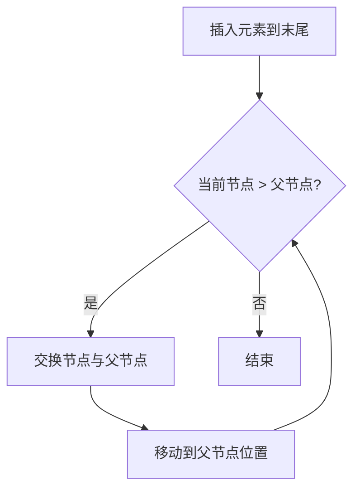
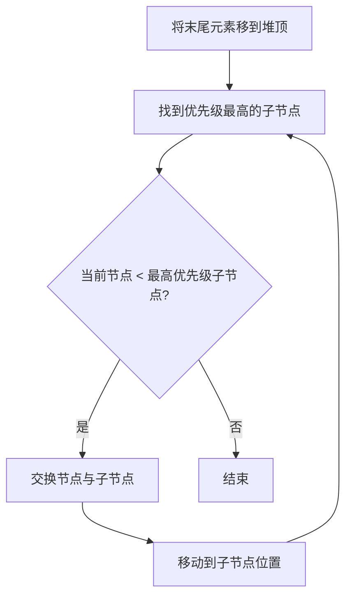

# C语言堆（Heap）数据结构实现

[](https://en.wikipedia.org/wiki/C99)
[](LICENSE)

> 一个基于C语言标准库实现的通用堆数据结构，支持最小堆和最大堆，提供完整的堆操作和堆排序功能。

## 📋 目录

- [功能特性](#-功能特性)
- [项目结构](#-项目结构)
- [快速开始](#-快速开始)
- [API文档](#-api文档)
- [算法原理](#-算法原理)
- [示例输出](#-示例输出)
- [作者信息](#-作者信息)

## ✨ 功能特性

- **双模式支持**：同时支持最小堆（Min Heap）和最大堆（Max Heap）
- **动态扩容**：基于动态数组实现，自动扩容以适应数据增长
- **高效建堆**：使用Floyd建堆算法，时间复杂度O(n)
- **堆排序**：提供原地堆排序功能，支持升序和降序
- **可视化输出**：支持树形结构打印，直观展示堆结构
- **标准C实现**：仅依赖C标准库，跨平台兼容

## 🚀 快速开始

### 编译运行

```bash
# 使用 GCC 编译
gcc -o heap 堆.cpp

# 运行
./heap
```

### 基础用法

```c
#include <stdio.h>

// 创建最小堆
Heap* minHeap = heapCreate(4, MIN_HEAP);

// 插入元素
heapPush(minHeap, 5);
heapPush(minHeap, 3);
heapPush(minHeap, 8);

// 查看堆顶
int top;
heapPeek(minHeap, &top);
printf("堆顶: %d\n", top);  // 输出: 堆顶: 3

// 弹出堆顶
int val;
heapPop(minHeap, &val);

// 销毁堆
heapDestroy(minHeap);
```

## 📖 API文档

### 数据结构

```c
typedef enum {
    MIN_HEAP,   // 最小堆：父节点 <= 子节点
    MAX_HEAP    // 最大堆：父节点 >= 子节点
} HeapType;

typedef struct {
    int* data;          // 存储元素的数组
    int size;           // 当前元素数量
    int capacity;       // 数组容量
    HeapType type;      // 堆类型
} Heap;
```

### 核心函数

| 函数                               | 描述             | 时间复杂度 |
| ---------------------------------- | ---------------- | ---------- |
| `heapCreate(capacity, type)`       | 创建堆           | O(1)       |
| `heapDestroy(h)`                   | 销毁堆           | O(1)       |
| `heapPush(h, value)`               | 插入元素         | O(log n)   |
| `heapPop(h, outValue)`             | 弹出堆顶         | O(log n)   |
| `heapPeek(h, outValue)`            | 查看堆顶         | O(1)       |
| `heapSize(h)`                      | 获取元素数量     | O(1)       |
| `heapIsEmpty(h)`                   | 判断是否为空     | O(1)       |
| `heapBuild(arr, n, type)`          | 从数组建堆       | O(n)       |
| `heapRemoveAt(h, index, outValue)` | 删除指定位置元素 | O(log n)   |
| `heapPrint(h)`                     | 打印堆（层序）   | O(n)       |
| `heapPrintTree(h)`                 | 打印堆（树形）   | O(n)       |
| `heapSort(arr, n, ascending)`      | 堆排序           | O(n log n) |

## 🔬 算法原理

### 堆的性质

堆是一种特殊的完全二叉树，满足以下性质：

- **最小堆**：每个节点的值都小于或等于其子节点的值
- **最大堆**：每个节点的值都大于或等于其子节点的值

### 核心操作

#### 1. 向上调整（Heapify Up）

插入元素后，从插入位置向上调整以维护堆性质：



#### 2. 向下调整（Heapify Down）

删除堆顶后，从根节点向下调整以维护堆性质：



#### 3. Floyd建堆算法

从最后一个非叶子节点开始，自底向上执行向下调整：

```
时间复杂度分析：
- 第 h 层节点最多需要调整 0 次
- 第 h-1 层节点最多需要调整 1 次
- ...
- 第 0 层节点最多需要调整 h 次

总时间复杂度：T(n) = O(n)
```

### 复杂度分析

| 操作     | 时间复杂度 | 空间复杂度 |
| -------- | ---------- | ---------- |
| 插入     | O(log n)   | O(1)       |
| 删除堆顶 | O(log n)   | O(1)       |
| 查看堆顶 | O(1)       | O(1)       |
| 建堆     | O(n)       | O(1)       |
| 堆排序   | O(n log n) | O(1)       |

## 📊 示例输出

```bash
C:\Users\anjuxi\Desktop\C语言 堆（Heap）>a.exe
=== 堆数据结构测试 ===

【最小堆测试】
插入序列: 5 3 8 1 9 2 7 4 6
MinHeap (size=9, capacity=16): 1 3 2 4 9 8 7 5 6

MinHeap Tree Structure:
        1
      3  2
  4  9  8  7
  5  6

依次弹出: 1 2 3 4 5 6 7 8 9

【最大堆测试】
插入序列: 5 3 8 1 9 2 7 4 6
MaxHeap (size=9, capacity=16): 9 8 7 6 3 2 5 1 4

MaxHeap Tree Structure:
        9
      8  7
  6  3  2  5
  1  4

依次弹出: 9 8 7 6 5 4 3 2 1

【Floyd建堆测试】
原始数组: 3 1 6 5 2 4
建堆结果: MinHeap (size=6, capacity=6): 1 2 4 5 3 6

MinHeap Tree Structure:
      1
    2  4
  5  3  6

【堆排序测试】
原始数组: 64 34 25 12 22 11 90
升序排序: 11 12 22 25 34 64 90
降序排序: 90 64 34 25 22 12 11

【删除操作测试】
MinHeap (size=9, capacity=16): 1 3 2 4 9 8 7 5 6
删除索引3的元素: 4
MinHeap (size=8, capacity=16): 1 3 2 5 9 8 7 6

MinHeap Tree Structure:
        1
    3  2
  5  9  8  7
6


=== 所有测试完成 ===
```

## 👤 作者信息

**谙弆悕博士（Ailan Anjuxi）**

- 📧 邮箱：[anjuxi.ME@outlook.com](mailto:anjuxi.ME@outlook.com)
- 📞 SIP电话：[sip:anjuxi@sip.linphone.org](sip:anjuxi@sip.linphone.org)

---

*本项目用于学习和教学目的，欢迎交流讨论！*
